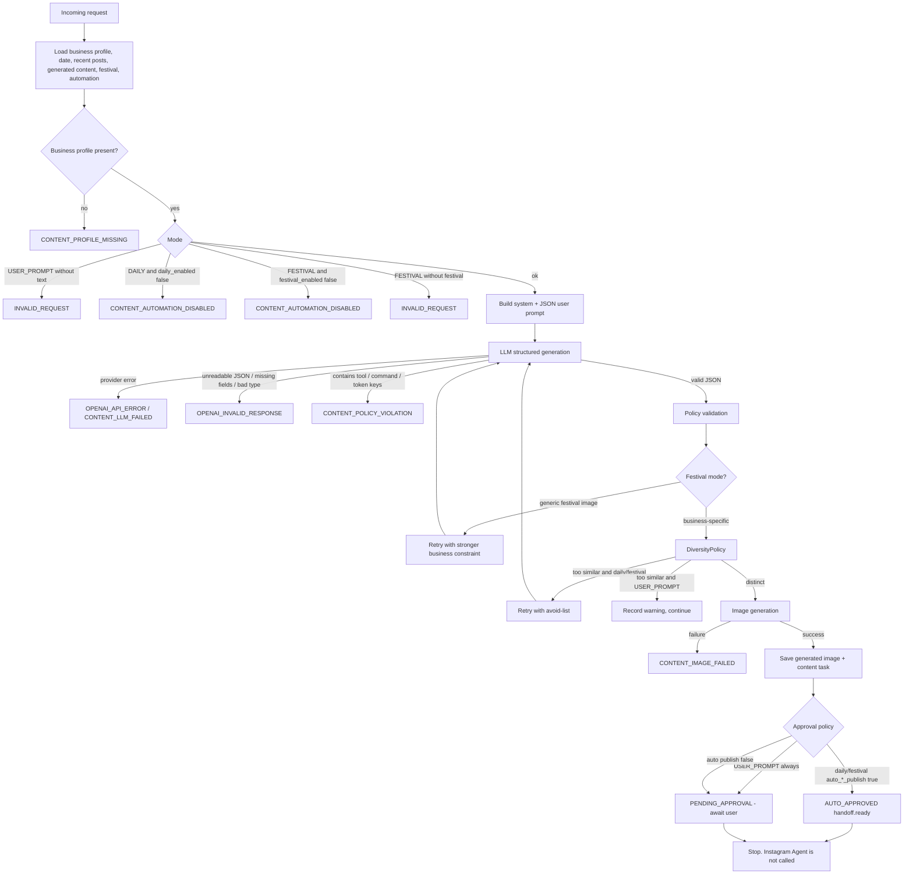

# Content Strategy Agent

The Content Agent is the intelligence layer for Instagram Agentic AI. It turns a business profile, calendar context, recent content, festival data, automation settings, and an optional user prompt into a **structured content plan**, then may generate an image.

It does **not** publish.

The existing Instagram Agent remains the only publisher. The Content Agent never selects `validate_image`, `prepare_image`, `upload_image`, `create_instagram_media`, `publish_instagram_media`, or `verify_publication`. It never uses the Instagram `ToolRegistry` allowlist and never runs `RecoveryPolicy` publish recovery.

```text
User / Scheduler
  → Content Agent
    → LLM (structured JSON)
      → Policy validation
        → Diversity check
          → Image generation
            → Save generated image
              → Approval decision
                → Content task / Instagram handoff (data only)
```

Publishing, if it happens later, is:

```text
Approved generated image
  → Instagram Agent
    → DeterministicPlanner
      → ToolRegistry (existing six tools)
        → Executor → Observation → RecoveryPolicy → Verification
```

---

## Modes

### USER_PROMPT

```text
User prompt
  → Content Agent
    → LLM
      → Structured plan
        → Image generation
          → Save
            → Await approval
```

Rules:

- A non-empty user prompt is required.
- A business profile is still required so the image is about *this* business.
- `approval_status` is always `PENDING_APPROVAL`.
- `handoff.ready` is always `false`.
- User-generated content is **never** auto-published, even if `auto_daily_publish` or `auto_festival_publish` is enabled.
- Diversity is advisory (logged / recorded). An explicit user request is not rejected for resembling recent posts.

### DAILY

```text
Business profile
+ recent content
+ current date (Asia/Kolkata by default)
+ automation settings
  → Content Strategy Agent
    → LLM
      → image prompt
        → image generation
          → automatic approval if auto_daily_publish
            → Instagram handoff (not a publish call)
```

Rules:

- `daily_enabled` must be true.
- Date, weekday, Indian season, products, brand style, and recent themes are sent to the LLM.
- Preferred content types rotate away from types used in the recent window.
- If `auto_daily_publish` is true, the task is `AUTO_APPROVED` and `handoff.ready=true`.
- If `auto_daily_publish` is false, the task waits for human approval.
- The Content Agent still does not call the Instagram Agent.

### FESTIVAL

```text
Festival
+ business profile
+ brand style
+ products / services
+ recent content
  → LLM
    → festival-specific business content
      → image generation
        → approval / auto-approval
          → Instagram handoff
```

Rules:

- `festival_enabled` must be true.
- Festival context (name, date, required posts) is required.
- The plan must mention this business (name, product, service, location, or brand style).
- Generic “Happy Diwali fireworks and diyas” images that would work for any brand are rejected.
- A jewellery store, a gym, and a grocery shop must not receive the same festival image.

---

## Content types

Supported `content_type` values:

| Type | Typical use |
| --- | --- |
| `PRODUCT` | Catalogue / hero product |
| `PROMOTION` | Offer, sale, campaign |
| `BRAND` | Brand story, craft, origin |
| `LIFESTYLE` | Customer-in-context scene |
| `EDUCATIONAL` | How-to, care, styling tip |
| `SEASONAL` | Season without a named festival |
| `FESTIVAL` | Named Indian festival, business-specific |
| `NEW_ARRIVAL` | Fresh stock or launch |
| `CUSTOMER_FOCUSED` | Social proof, gifting, customer moment |

The LLM may return aliases such as `product_promotion`. The agent normalizes them onto the enum above. Unknown types fail as `OPENAI_INVALID_RESPONSE`.

---

## Decision flow



---

## Context assembled for the LLM

Every LLM call includes:

1. **Business profile** — name, type, category, description, audience, location, brand style, language, products, services.
2. **Current date** — ISO date, weekday, Indian season, timezone (`Asia/Kolkata` default).
3. **Recent posts** — type, theme, prompt snippet, product, festival, source, status.
4. **Recent generated content** — same shape, including unpublished drafts.
5. **Festival context** — name, date, required vs published counts, notes.
6. **Automation settings** — daily/festival flags and auto-publish flags (never secrets).
7. **User prompt** — when mode is `USER_PROMPT`.
8. **Preferred content types** — types least used in the recent window.
9. **Avoid-list** — prior invalid or repetitive attempts in this run.

The LLM is told it cannot publish, execute code, call tools, or access credentials.

---

## Structured plan

Required JSON:

```json
{
  "content_type": "PRODUCT",
  "theme": "kundan_necklace_evening",
  "image_prompt": "...",
  "business_context": "...",
  "reason": "daily product rotation",
  "caption_hint": "optional",
  "featured_product_or_service": "optional",
  "audience_angle": "optional"
}
```

Policy validation rejects:

- Keys such as `command`, `code`, `script`, `python`, `shell`, `url`, `http`, `https`, `token`, `access_token`, `tool`, `tools`, `publish`, `instagram`.
- Any value that is an Instagram allowlisted tool name.
- Mentions of those tool names inside the prompt/theme/reason.

The Instagram `LLMPlanner` allowlist is **not** reused here. Pointing the Instagram planner at OpenAI with `publish_instagram_media` in scope remains forbidden.

---

## Diversity (V1)

Practical, not embedding-based.

`DiversityPolicy` inspects the last eight items of recent posts + generated images:

| Signal | Action |
| --- | --- |
| Normalized theme equality | Reject |
| Jaccard token overlap of image prompts ≥ 0.72 | Reject |
| Same `content_type` more than twice in the window | Reject |
| Same festival name + same featured product | Reject |

Daily and festival modes **block** on rejection and retry the LLM once with an avoid-list. If the retry is still repetitive: `CONTENT_DIVERSITY_REJECTED`.

User-prompt mode records the verdict but does not fail the request.

### Extension point

```python
class SemanticSimilarityBackend:
    name = "semantic_embeddings_future"
    enabled = False
    def score(self, left: str, right: str) -> float: ...
```

V1 does not load embeddings. When a later agent wires an embedding model, set `enabled=True` and implement `score`. `DiversityPolicy` already consults this backend when enabled.

---

## Approval and handoff

| Mode | Setting | Result |
| --- | --- | --- |
| USER_PROMPT | ignored | `PENDING_APPROVAL`, no handoff |
| DAILY | `auto_daily_publish=false` | `PENDING_APPROVAL`, no handoff |
| DAILY | `auto_daily_publish=true` | `AUTO_APPROVED`, `handoff.ready=true` |
| FESTIVAL | `auto_festival_publish=false` | `PENDING_APPROVAL`, no handoff |
| FESTIVAL | `auto_festival_publish=true` | `AUTO_APPROVED`, `handoff.ready=true` |

`ContentStrategyResult.published` is **always** `false`.

`InstagramHandoff` is a data package for FastAPI / the scheduler / Agent 8:

- `generated_image_id`
- `image_path`
- `caption` (proposed only)
- `user_id`
- `source`
- `requires_instagram_agent=true`

Those callers may then run `InstagramAgent.run(...)`. The Content Agent does not.

---

## Persistence contract

The agent duck-types the database layer (Agent 2) and AI providers (Agent 4):

**Context store (optional if the request already carries snapshots)**

- `get_business_profile(user_id)`
- `get_automation_settings(user_id)`
- `list_recent_posts(user_id)`
- `list_recent_generated(user_id)`
- `get_festival_context(user_id, on_date)`
- `save_generated_image(record)`
- `save_content_task(task)`

ORM objects with the Agent 2 field names (`business_name`, `brand_style`, `products`, `original_prompt`, `approval_status`, `source`, …) are accepted via `from_attributes`.

**LLM provider**

Preferred method: `generate_structured(system_prompt=, user_prompt=, schema=)`.  
Also accepted: `complete_structured`, `generate_content_plan`, `generate`, `complete`, `chat`.

**Image provider**

Preferred method: `generate(prompt=, user_id=, source=, metadata=)`.  
The image provider must not publish to Instagram.

---

## Errors

| Code | When |
| --- | --- |
| `CONTENT_PROFILE_MISSING` | No business profile |
| `CONTENT_AUTOMATION_DISABLED` | Daily/festival mode while that flag is off |
| `OPENAI_API_ERROR` / `CONTENT_LLM_FAILED` | Provider failure |
| `OPENAI_INVALID_RESPONSE` | Malformed JSON, missing fields, unknown type |
| `CONTENT_POLICY_VIOLATION` | Plan tried to execute or publish |
| `CONTENT_INVALID_PLAN` | Generic festival / not business-specific |
| `CONTENT_DIVERSITY_REJECTED` | Still repetitive after retry |
| `CONTENT_IMAGE_FAILED` | Image provider failed |
| `OPENAI_CONFIGURATION_ERROR` | Missing key, bubbled from the provider |

Secrets (OpenAI keys, Meta tokens, passwords) are never sent to the LLM and never stored on the content task.

---

## What this agent does not do

- Call Meta / Instagram Graph APIs.
- Register or execute Instagram tools.
- Bypass `ToolRegistry` for publishing.
- Auto-approve user-prompt content.
- Increment published-post counters (only verified `PUBLISHED` records count, and that is the Instagram Agent + database).
- Run the scheduler (Agent 7).
- Serve React (Agent 9).

---

## Files

| File | Role |
| --- | --- |
| `agent/content_agent.py` | Agent, prompts, diversity, provider adapters |
| `models/content.py` | Enums and Pydantic contracts |
| `tests/test_content_agent.py` | Mode, diversity, failure, and policy tests |
| `CONTENT_AGENT.md` | This decision-flow document |
